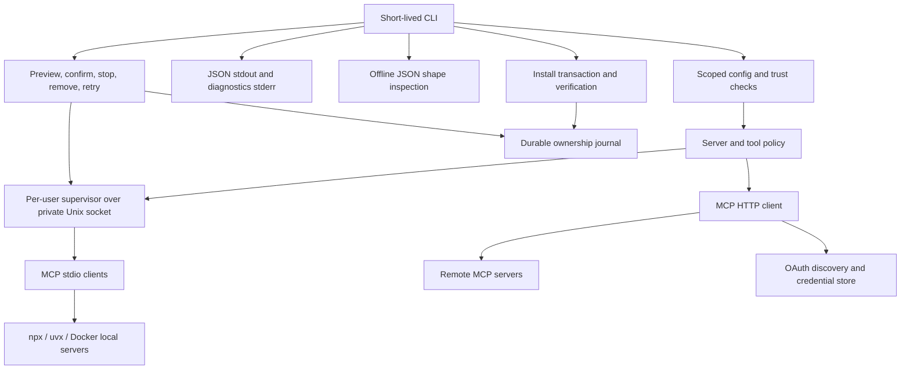

# V1 implementation plan - 2026-09-08

## Goal and current state

Implement the command surface supplied by the user, with persistent local MCP
servers, remote connections, OAuth, trusted project configuration, safe cleanup,
and shell-friendly tool invocation. This directory is the implementation tracker
for the user and subsequent agents, not product documentation.

The original baseline was an entry-point stub with no application dependencies.
Phases 01-06 are complete: typed CLI/error/output contracts, isolated fixtures,
configuration/storage/trust and ownership foundations, the tools-focused MCP
client, persistent local supervisor lifecycle, secure remote OAuth, and staged installation transactions. Passive
`servers`, interactive `trust`, local `start`/`stop`, and qualified local tool
operations are operational.
Local execution requires a prepared immutable installation record; installation now
prepares local dependencies, verifies discovery without calls, retains successful
local processes, and registers remote endpoints. Qualified remote tool operations
and explicit auth login/status/logout are operational. Cross-server/shorthand
workflow and cleanup remain in their respective phases.
See the phase handoffs for validation evidence and integration contracts.

The user's [confirmed command list](commands.md) overrides tentative spellings in
`docs/ideas/`. Agreed requirements in those notes remain requirements. Proposed
technical choices below are not silently promoted to user-approved decisions.

## Phase tracker

| Phase | Grouped work | Dependencies | Status |
| --- | --- | --- | --- |
| [01](01-foundation.md) | Resolve contracts, CLI, errors, test infrastructure | None | Done |
| [02](02-configuration-trust.md) | Storage, configuration, scope, trust, ownership records | 01 | Done |
| [03](03-protocol-client.md) | MCP client, transports, discovery, cancellation | 01, 02 | Done |
| [04](04-supervisor-lifecycle.md) | Persistent local processes, supervisor, lifecycle and status | 02, 03 | Done |
| [05](05-authentication.md) | Remote OAuth and secure credential lifecycle | 02, 03 | Done |
| [06](06-installation.md) | Local preparation, remote registration, verification, rollback | 02, 03, 04, 05 | Done |
| [07](07-tool-workflow.md) | Tool policy, discovery, qualified/shorthand calls, shape | 03, 04, 05, 06 | Not started |
| [08](08-cleanup.md) | Uninstall, clean uninstall, self-removal and recovery | 02, 04, 06, 07 | Not started |
| [09](09-v1-validation.md) | Full-system regression, failure recovery and v1 readiness | All previous phases | Not started |

Default execution order is numeric. Phase 05 can run alongside 04 after 03.
Do not start a dependent integration until its prerequisite contracts are stable.
Each phase groups a usable subsystem rather than a single small change.

## Agent workflow and progress rules

1. Read this overview, the target phase, `AGENTS.md`, and its referenced ideas.
2. Check the actual code and working tree. Do not assume a checked box proves the
   code still works, and do not overwrite unrelated work.
3. Resolve blocking decisions before implementing the affected behavior. Record
   approvals here; do not infer approval from a recommended default.
4. Mark the phase `In progress` here and in its file. Implement code and tests in
   coherent increments. Check a task only when its code and relevant tests exist.
5. Run the phase-specific tests and the repository validation gate. Record exact
   commands, results, and any environmental limitations in the phase handoff.
6. Mark a phase `Done` only when its acceptance criteria pass and dependencies are
   complete. Otherwise use `Blocked` with a precise reason and next action.
7. Update the handoff before stopping: completed work, remaining work, changed
   paths, test evidence, decisions, and the next executable task. Record commit
   IDs if commits were made; this plan does not require making commits.

Tracker maintenance is allowed during implementation. Do not add product docs,
README changes, tutorials, an agent skill, or changelog/release prose as phase
work. Product documentation is the user's final step after code is complete.

## Approved architecture



The supervisor owns local standard streams across CLI invocations. Remote client
lifetime is decided with the selected transport profile; remote servers are never
managed as local processes. Server identities must include effective scope and
configuration identity, not just a display name. Recheck trust and effective
policy for every operation that can execute or authenticate, including requests
to an already-running supervisor.

## Intended code areas

Paths are proposed boundaries, not a requirement to create an empty file tree.
Split modules further when needed to satisfy repository complexity limits.

```diff
~ Cargo.toml
~ Cargo.lock (create if absent)
~ src/main.rs
+ src/lib.rs
+ src/cli.rs
+ src/error.rs
+ src/output.rs
+ src/config/
+ src/storage/
+ src/trust/
+ src/ownership/
+ src/mcp/
+ src/supervisor/
+ src/auth/
+ src/install/
+ src/tools/
+ src/shape/
+ src/cleanup/
+ tests/
```

No README changes. Avoid changing the lint implementation to accommodate new
code; use explicit types for non-primitive local bindings from the start.

## Decisions to approve before dependent work

D01-D10 are **approved** by the user on September 8, 2026. Approval preserves
the technical verification gates in D05, D08, and D10. Phase 01 converts these
choices into executable contracts/tests. Stop only affected work when blocked.

| ID (approved) | Approved decision | Blocks |
| --- | --- | --- |
| D01 | Linux-only v1; fail clearly on unsupported systems. One per-user supervisor with isolated scoped server identities. | 02, 04, 08 |
| D02 | Native versioned JSON config. Nearest ancestor `.ripmcp/config.json`, search through filesystem root, do not combine nested projects. Project server definitions replace same-named user definitions as a whole, rather than merging credentials/commands. Reject malformed selected config; do not silently fall back. | 02 |
| D03 | Add mutually exclusive `--user` / `--project` to config-changing commands; default writes to user scope. Project scope requires a discovered project root rather than inventing one. A mutation must report when a trusted project override shadows its target. Editing a trusted project's content invalidates trust, including edits made by ripmcp. | 01, 02, 06, 07 |
| D04 | Approve exact install forms: `install <server> --npx <package> [-- <args>...]`, `--uvx <package>`, `--docker <image>`, and `--config <file>` for a native server-definition JSON object. No implicit foreign-format import. Reject duplicate names in the target scope; no overwrite/update flag in v1. Require existing runtimes; do not install Node, Python tooling, or Docker. | 01, 06 |
| D05 | Target requested MCP revision `2026-07-28`, tools-focused stdio and Streamable HTTP, no implicit older-version fallback. Verify the actual official revision, authorization requirements, and Rust library coverage before selecting dependencies. These notes are not a protocol audit. If unavailable or incompatible, ask the user rather than substitute a revision. | 03, 05 |
| D06 | Full MCP tool-result envelope as JSON stdout, no automatic result cache or truncation. Tool-reported failures retain their envelope but exit nonzero. Other data commands use stable JSON shapes; diagnostics/prompts use stderr. Built-in shape accepts a file or `-`, with explicit bounds and truncation indicators. | 01, 07 |
| D07 | Disable blocks future use but does not stop an existing local process. Explicit start of a disabled server fails. Listing servers is passive. `tools <server>` rejects disabled servers; `--all` includes disabled tools, not an override of server enablement. | 04, 07 |
| D08 | Explicit browser OAuth login blocks until credentials persist, with timeout/cancel. If browser opening fails, print a URL and keep the local callback flow available. No device flow or remote-headless redirect in v1. Select a concrete compliant client-registration profile and OS-backed credential store after technical verification; fail closed if secure storage is unavailable. | 05 |
| D09 | Clean uninstall deletes only exclusively owned tracked resources, confirms before all mutations, and retains retry records on failures. Self-uninstall includes exclusively owned data without a second cleanup flag, preserves project configs, and reports manual package-manager removal when necessary. Unknown binary ownership means preserve and report incomplete removal. | 08 |
| D10 | When `XDG_RUNTIME_DIR` is missing/invalid, use an explicitly validated per-user private fallback under the system temporary directory. Refuse symlinks, foreign ownership and unsafe permissions; never accept an arbitrary existing socket. Exact fallback and locking behavior require security tests before approval. | 02, 04 |

Additional engineering choices are recorded in [foundation contracts](contracts.md):
timeout config/defaults, exit codes, shape bounds, delegated version resolution,
verification process retention, remote ownership, secret references and untrusted
reads. Phase 03 verified D05's exact revision and transport profile; phase 05
verified the OAuth registration/storage profile and completed D08 with local
fixtures and a fake secure-store adapter. Its handoff records provider limits and
integration APIs. Phase 02 validated D10 directory creation, ownership/mode checks,
no-follow access and locking; phase 04 completed socket peer and stale-socket
validation.

## Validation gate for every implementation phase

Run from the repository root, with phase tests added as the code grows:

```sh
cargo fmt -q
cargo clippy -q --all-targets -- -D warnings
cargo test -q
cargo dylint --all -- --locked --all-targets
(cd lints/explicit-local-types && cargo fmt -q && cargo test -q --locked)
```

Tests must isolate HOME/XDG directories and never depend on personal credentials,
real project trust, public MCP servers, or deleting real installed resources.
Use local stdio/HTTP/OAuth fixtures, fake runtime executables, and sandboxed cleanup
resources. Keep opt-in real-runtime smoke tests separate from default tests.
Missing tools or network access are recorded as validation limitations, not passes.

## Source map

- `commands.md`: authoritative user command list, plus approved install/scope syntax.
- `contracts.md`: implementation choices and protocol/security verification gates.
- `docs/ideas/index.md`: clarified requirements and lifecycle agreements.
- `docs/ideas/v1-scope.md`: protocol target, essentials and deferrals.
- `docs/ideas/configuration.md`: agreed Linux paths, override and trust requirements.
- `docs/ideas/server-management.md`: preparation, ownership, enablement and lifecycle.
- `docs/ideas/authentication.md`: OAuth, blocking login and credential binding.
- `docs/ideas/tool-workflow.md`: unique-name resolution and offline shape workflow.
- `docs/ideas/self-uninstall.md`: executable removal and preservation constraints.
- `src/`, `tests/`, `Cargo.toml`: CLI foundation, contracts and isolated fixtures.
- `AGENTS.md`, `.cargo/config.toml`, `clippy.toml`,
  `lints/explicit-local-types/Cargo.toml`: coding and validation constraints.

## Final boundary

V1 implementation is complete only after phase 09 passes. Product documentation
then belongs to the user and is not an unchecked implementation phase. Deferred:
GUI/agent loop, registry browsing, automatic updates, idle shutdown, general
package management, project-config deletion, a custom JSON query language,
implicit tool-call retries, result-cache lifecycle, and non-tools MCP features
unless required by the explicitly approved protocol profile.
